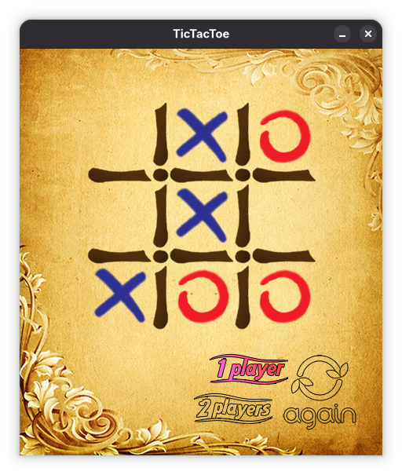

# TicTacToe

I developed this game during the Spring semester of 2018 as part of my _Artificial Intelligence and Expert Systems: Design of Algorithms_ course. The project took me roughly half a day to complete. 
I programmed the game using Java, implemented the MiniMax algorithm, and built its graphical user interface with JavaFX and Adobe Photoshop. 
Players can choose to compete against another human or challenge the computer; however, the computer is unbeatable because it relies on a fully explored MiniMax decision tree.
To run the game, navigate to the bin directory and execute the following command: java --module-path /path-to-your-javafx-directory/openjfx/lib --add-modules=javafx.controls Main

